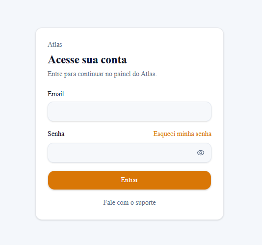
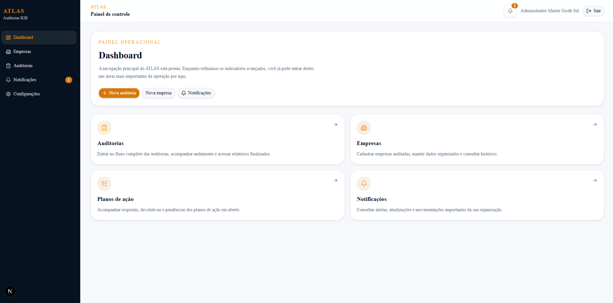
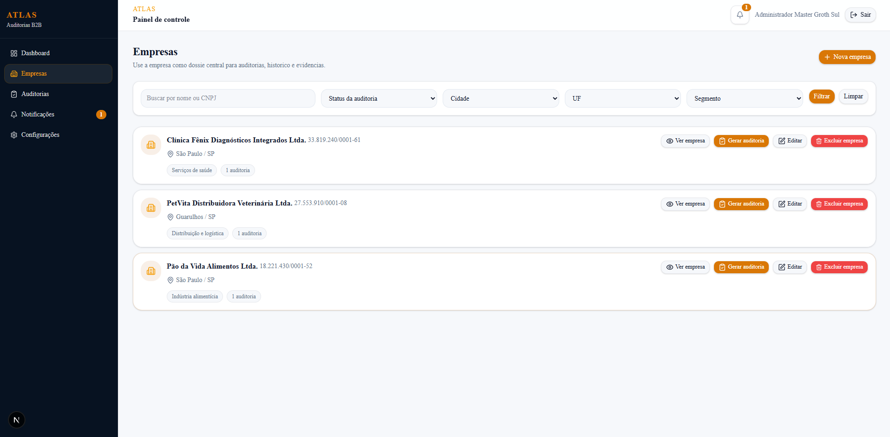
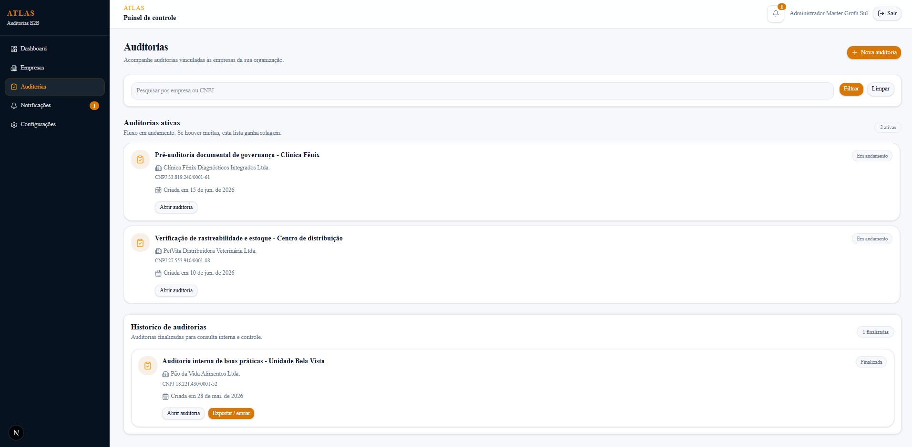
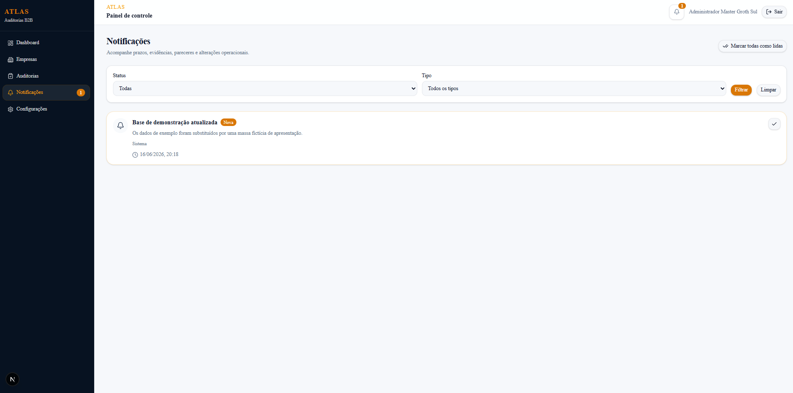
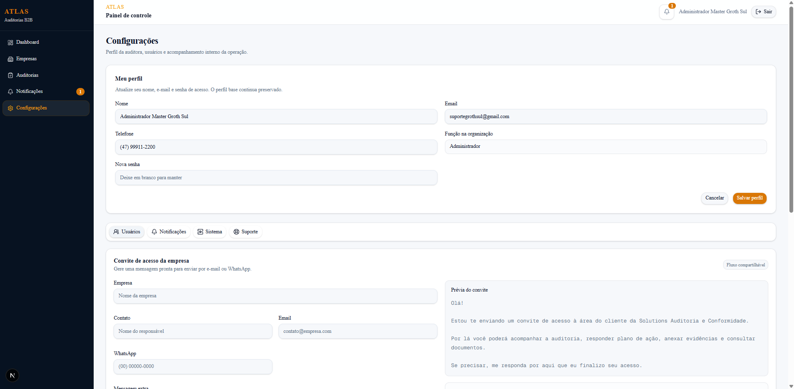
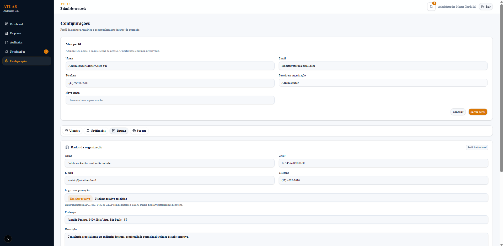
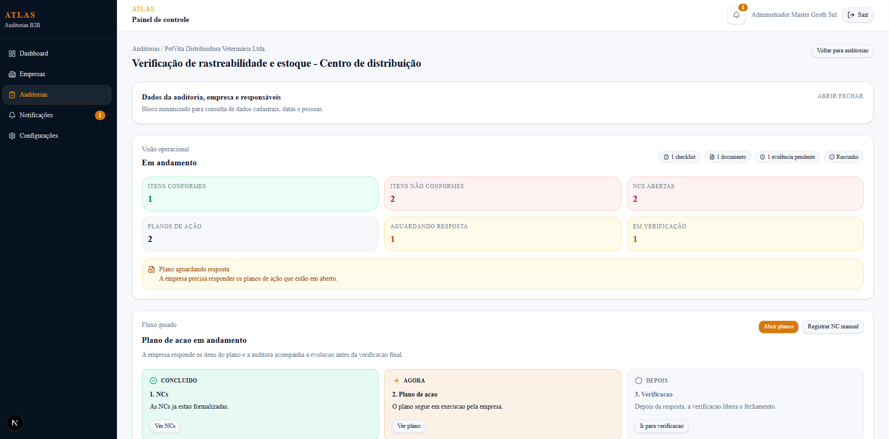
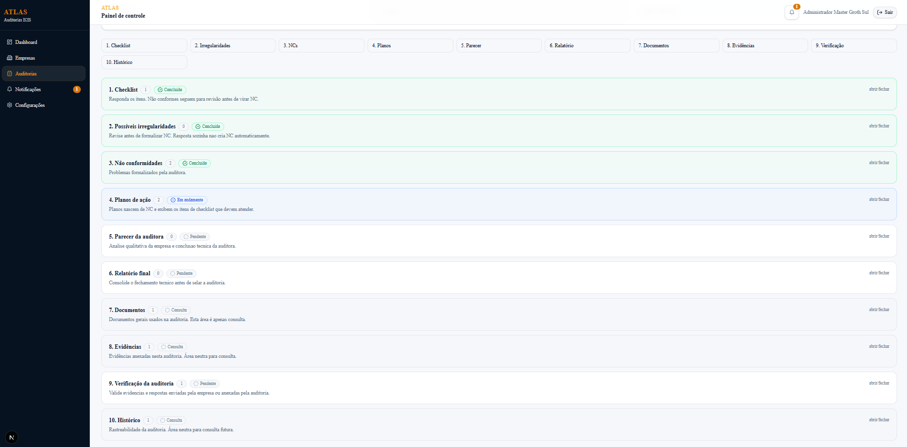
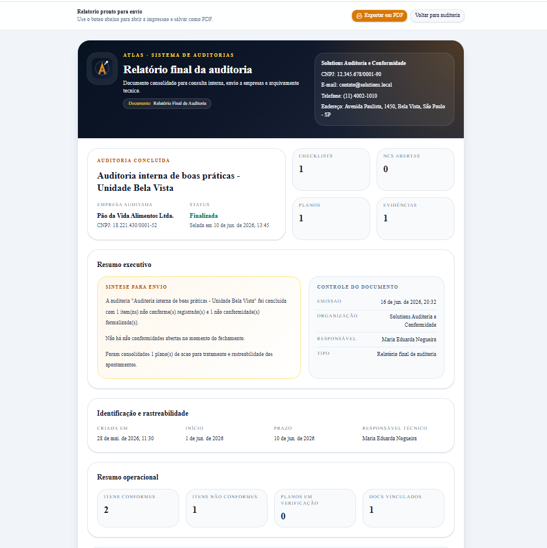

# ATLAS

Plataforma de auditorias, conformidade, nao conformidades e planos de acao para consultorias, auditoras independentes e empresas que precisam organizar seu ciclo operacional de verificacao.


## Visao Geral

O ATLAS nasceu para resolver uma dor muito comum em operacoes de auditoria: informacao espalhada entre planilhas, mensagens, documentos soltos, controles paralelos e acompanhamento manual de pendencias.

Em vez de tratar a auditoria como um evento isolado, o projeto organiza o fluxo completo:

- cadastro de empresas auditadas;
- criacao e execucao de auditorias;
- aplicacao de checklists reutilizaveis;
- formalizacao de nao conformidades;
- abertura e revisao de planos de acao;
- anexos, evidencias e documentos de apoio;
- notificacoes operacionais;
- gestao da organizacao auditora e dos usuarios vinculados.

O objetivo e transformar um processo fragmentado em uma trilha rastreavel, auditavel e comercialmente apresentavel.

## Problema que o Projeto Resolve

Na pratica, muitas consultorias e auditoras trabalham com:

- dados cadastrais espalhados;
- auditorias sem historico centralizado;
- checklists sem versionamento confiavel;
- nao conformidades abertas sem acompanhamento consistente;
- planos de acao sem governanca;
- evidencias perdidas em conversas, e-mails ou pastas soltas;
- dificuldade para entregar relatorios com aparencia profissional.

O ATLAS centraliza esse ciclo em uma unica aplicacao, reduzindo atrito operacional e aumentando a clareza para auditora e empresa auditada.

## Publico-Alvo

O produto foi pensado para tres perfis principais:

- consultorias de auditoria;
- auditoras independentes;
- empresas que executam auditorias internas, de qualidade, seguranca, conformidade ou melhoria continua.

## Proposta de Valor

Com o ATLAS, a auditora consegue:

- padronizar sua operacao;
- reutilizar modelos de checklist;
- acompanhar pendencias reais em um so lugar;
- registrar historico e responsaveis;
- emitir relatorios mais profissionais;
- oferecer um portal organizado para empresas auditadas;
- transformar seu servico em uma entrega com mais percepcao de valor.

## Principais Funcionalidades

### Autenticacao e perfis

O sistema utiliza autenticacao com controle por organizacao e perfis de acesso:

- `ADMIN`: gestao ampla da operacao e da organizacao;
- `CONSULTANT`: execucao operacional das auditorias;
- `CLIENT`: acesso restrito a visao da empresa auditada.

### Empresas

Cadastro estruturado de empresas auditadas com campos como:

- razao social;
- nome fantasia;
- CNPJ;
- segmento;
- dados do responsavel;
- endereco;
- observacoes e campos extras.

### Auditorias

Cada auditoria e vinculada a uma empresa e possui:

- status;
- responsavel;
- datas;
- historico;
- checklists aplicados;
- nao conformidades relacionadas;
- documentos e parecer final.

### Checklists

Os modelos de checklist sao reutilizaveis e permitem perguntas do tipo:

- Sim/Nao;
- texto;
- numero;
- data;
- multipla escolha.

Quando o checklist e aplicado em uma auditoria, o sistema gera um snapshot dos itens para preservar o historico mesmo que o modelo original seja alterado depois.

### Nao conformidades

As nao conformidades formalizam os achados identificados durante a auditoria, com severidade, responsavel, prazo e rastreabilidade.

### Planos de acao

Cada nao conformidade pode originar um ou mais planos de acao, com revisao, aprovacao, reprovacao, historico e acompanhamento de evidencias.

### Evidencias e documentos

O sistema contempla anexos e documentos relacionados ao fluxo da auditoria e dos planos de acao, fortalecendo a trilha de comprovacao.

### Relatorio final

O projeto inclui uma visao de relatorio final de auditoria com estrutura executiva, identificacao das partes, parecer, pendencias, checklists, nao conformidades e anexos.

### Configuracoes

A area de configuracoes cobre:

- dados da organizacao auditora;
- usuarios e permissoes;
- convites de acesso;
- suporte;
- indicadores operacionais do sistema.

## Fluxo de Negocio

```text
Empresa auditada
-> Auditoria
-> Checklist aplicado
-> Respostas
-> Nao conformidades
-> Planos de acao
-> Evidencias e documentos
-> Parecer final
-> Relatorio
```

## Arquitetura do Projeto

O codigo esta organizado por modulos de dominio, buscando separar responsabilidades entre interface, regras de validacao, acoes e servicos.

```text
src/
|-- app/                # rotas e composicao de paginas
|-- components/         # componentes compartilhados
|-- features/           # modulos por dominio de negocio
|-- lib/                # utilitarios, auth, politicas e helpers
|-- generated/          # cliente Prisma gerado
`-- types/              # tipos complementares
```

Dentro de `features/`, o padrao adotado e:

```text
feature/
|-- actions/            # acoes do servidor e mutacoes
|-- components/         # interface da feature
|-- schemas/            # validacoes com Zod
`-- services/           # leitura, composicao de dados e regras
```

## Principios Tecnicos

Este projeto foi construido com foco em:

- separacao por dominio de negocio;
- validacao explicita com Zod;
- controle de acesso no servidor;
- rastreabilidade das alteracoes;
- clareza de fluxo para futuras evolucoes;
- base adequada para refatoracao incremental.

Na manutencao, a meta e continuar aproximando o projeto de boas praticas de:

- SRP e separacao de responsabilidades;
- Clean Code;
- componentes pequenos e reutilizaveis;
- servicos orientados a dominio;
- refatoracao segura com validacao por lint, build e testes.

## Tecnologias Utilizadas

### Front-end

- Next.js 16
- React 19
- TypeScript
- Tailwind CSS 4
- shadcn/ui
- lucide-react

### Back-end e dados

- Next.js App Router
- Server Actions
- NextAuth
- Prisma ORM
- PostgreSQL / Neon

### Formularios e validacao

- React Hook Form
- Zod

### Seguranca

- bcryptjs
- RBAC por perfil
- escopo por organizacao

## Decisoes Importantes de Produto

Algumas decisoes relevantes do ATLAS:

- checklist aplicado gera snapshot para preservar historico;
- organizacao auditora e empresas auditadas ficam separadas no modelo de negocio;
- permissoes criticas sao verificadas no servidor;
- relatorios e historico sao tratados como parte da entrega, nao como detalhe visual;
- o portal do cliente foi pensado para manter foco operacional sem expor controles administrativos.

## Estado Atual do Projeto

O ATLAS ja esta em um ponto funcional de demonstracao e operacao assistida, com:

- autenticacao por perfis;
- navegacao principal estruturada;
- CRUDs centrais das entidades principais;
- execucao de auditoria e checklist;
- gestao de nao conformidades;
- gestao de planos de acao;
- notificacoes internas;
- configuracoes da organizacao;
- relatorio final de auditoria;
- favicon e identidade visual;
- fluxos demonstrativos de convite e recuperacao de senha;
- base ficticia realista para apresentacao comercial.

## Limitacoes Atuais

Algumas frentes ainda estao em modo demonstrativo ou preparadas para evolucao:

- convite por e-mail ainda sem provedor transacional real configurado;
- recuperacao de senha ainda sem fluxo transacional definitivo;
- integracao de envio sera ligada ao provedor final quando houver dominio e canal oficial;
- ainda ha espaco para novas rodadas de refatoracao e padronizacao textual.

## Como Executar Localmente

### 1. Instale as dependencias

```bash
npm install
```

### 2. Configure as variaveis de ambiente

Crie `.env.local` com pelo menos:

```env
DATABASE_URL="postgresql://..."
AUTH_SECRET="sua-chave-local"
```

Observacao:

- o projeto nao depende mais de `NEXTAUTH_URL` fixo para rodar em uma porta especifica;
- isso evita conflitos entre `3000`, `3001` e outras portas locais.

### 3. Gere o cliente Prisma e aplique as migrations

```bash
npx prisma generate
npx prisma migrate dev
```

### 4. Popule a base com dados iniciais

```bash
npm run db:seed
```

### 5. Rode o projeto

```bash
npm run dev
```

Ou, em producao local:

```bash
npm run build
npm run start
```

Se quiser iniciar explicitamente na porta `3001`:

```bash
npm run start:3001
```

## Usuarios de Demonstracao

A base ficticia de apresentacao e criada pelo seed com os seguintes acessos:

```text
ADMIN MASTER
suportegrothsul@gmail.com
Groth@123

AUDITORA ADMIN
maria.eduarda@solutions.local
Maria@123

CONSULTOR
klember.silva@solutions.local
Klember@123
```

## Scripts Disponiveis

```bash
npm run dev
npm run build
npm run start
npm run start:3001
npm run lint
npm run typecheck
npm run test
npm run db:seed
```

## Testes e Qualidade

O projeto ja possui este fluxo minimo de qualidade:

- `eslint` para padronizacao e seguranca estatica;
- `tsc --noEmit` para validacao de tipos;
- testes automatizados para regras centrais de autenticacao e politica de acesso;
- build de producao para garantir integridade do App Router.

## CI

Ha uma pipeline em `.github/workflows/ci.yml` que executa:

- instalacao das dependencias;
- lint;
- typecheck;
- testes;
- build.

Isso cria uma base consistente para CI/CD e futuras automacoes de deploy.

## Roadmap Recomendado

### Curto prazo

- finalizar a revisao textual completa de todas as telas;
- conectar convite e recuperacao de senha a um provedor de e-mail real;
- adicionar troca obrigatoria de senha no primeiro acesso;
- ampliar a suite de testes.

### Medio prazo

- painel analitico com KPIs reais;
- filtros operacionais mais avancados;
- envio de relatorios por fluxo assistido;
- onboarding mais forte para empresas auditadas.

### Longo prazo

- assinatura de auditorias;
- emissao PDF refinada;
- trilha avancada de aprovacao;
- portal do cliente mais completo;
- operacao multi-organizacao ainda mais madura.

## Capturas de Tela

As principais capturas de demonstracao ficam em `public/screenshots`:

### 1. Login



### 2. Dashboard



### 3. Empresas



### 4. Auditorias



### 5. Notificacoes



### 6. Configuracoes - Perfil e convite



### 7. Configuracoes - Dados da organizacao



### 8. Auditoria aberta - Visao geral



### 9. Auditoria aberta - Fluxo



### 10. Relatorio final



## Resultado Esperado

O ATLAS nao foi pensado apenas como um CRUD. Ele foi desenhado para se tornar uma base de produto vendavel para auditoria operacional, com trilha de conformidade, percepcao de profissionalismo e espaco claro para evolucao comercial.

## Autoria

Projeto desenvolvido por **Luana Groth**.
