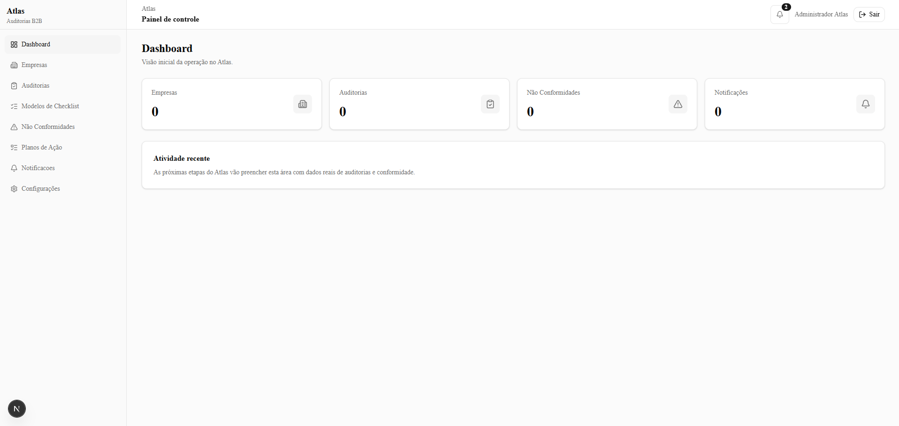
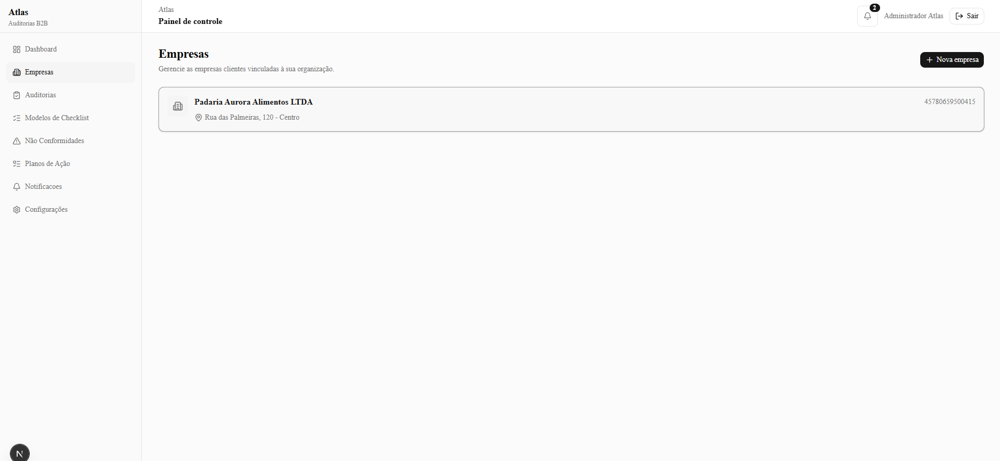
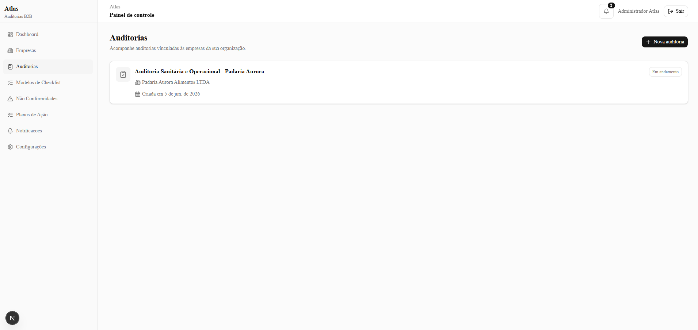
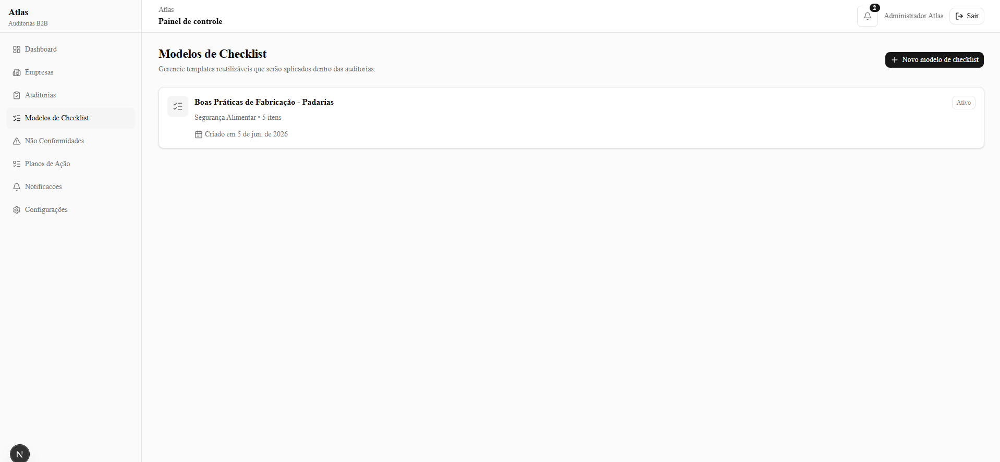
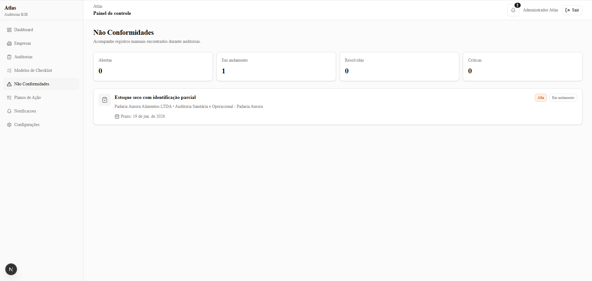
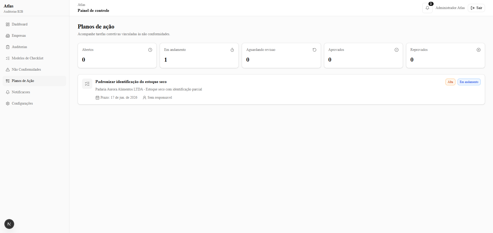
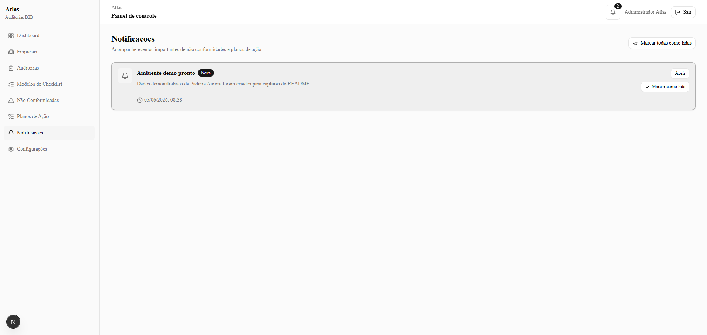
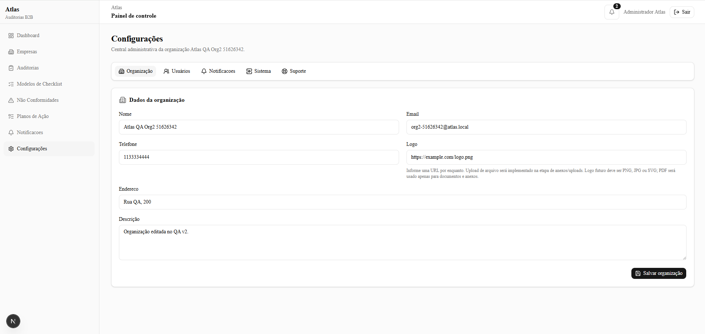

# Atlas 1.0

Sistema de auditorias, conformidade, não conformidades e planos de ação para consultorias e empresas.


## Sobre o Projeto

Atlas é uma plataforma de gestão de auditorias desenvolvida para auxiliar consultorias, empresas e profissionais responsáveis por processos de conformidade, segurança, qualidade e melhoria contínua.

O sistema centraliza o fluxo operacional de auditoria:

- empresas auditadas
- auditorias
- modelos de checklist
- execução de auditorias
- não conformidades
- planos de ação
- notificações
- gestão organizacional

O objetivo é garantir rastreabilidade completa desde a auditoria até a resolução dos problemas identificados.

## Objetivo do Projeto

O Atlas foi criado para resolver um problema comum em processos de auditoria: informações espalhadas em planilhas, documentos, mensagens e controles manuais.

Com o Atlas, a consultoria ou empresa consegue centralizar o ciclo de conformidade em uma única aplicação, mantendo histórico, responsáveis, prazos, evidências futuras e status de cada etapa.

## Screenshots

### Dashboard



### Empresas



### Auditorias



### Modelos de Checklist



### Não Conformidades



### Planos de Ação



### Notificações



### Configurações



## Principais Funcionalidades

### Autenticação e Permissões

Sistema de autenticação baseado em papéis, com controle por organização.

Perfis disponíveis:

#### ADMIN

- gerencia toda a organização
- cria auditorias
- cria modelos de checklist
- cria não conformidades
- cria planos de ação
- gerencia usuários
- remove acessos
- aprova ou reprova planos de ação

#### CONSULTANT

- executa auditorias
- cria modelos de checklist
- cria não conformidades
- cria planos de ação
- atualiza registros
- aprova ou reprova planos de ação

#### CLIENT

- visualiza dados da organização
- responde ações atribuídas
- envia planos de ação para revisão
- acompanha notificações e pendências

### Empresas

Cadastro completo de empresas auditadas.

Recursos:

- razão social
- nome fantasia
- CNPJ/documento
- tipo jurídico
- segmento
- endereço
- CEP com integração ViaCEP
- responsável
- número de colaboradores
- campos extras personalizados por ramo

Validações:

- CNPJ
- email
- telefone
- CEP
- duplicidade por CNPJ dentro da organização
- duplicidade por nome quando a empresa não possui CNPJ

Regras:

- `ADMIN` e `CONSULTANT` podem criar e editar.
- apenas `ADMIN` pode excluir.
- empresas com auditorias vinculadas não podem ser excluídas.

### Modelos de Checklist

O Atlas trabalha com templates reutilizáveis.

Os modelos são criados uma vez e depois aplicados dentro das auditorias.

Tipos de perguntas:

- Sim/Não
- Texto
- Número
- Data
- Múltipla escolha

Os templates não ficam vinculados diretamente a empresas. O vínculo real acontece no fluxo:

```txt
Auditoria -> Aplicar modelo de checklist
```

### Auditorias

Cada auditoria é vinculada a uma empresa.

Recursos:

- status
- criador
- empresa vinculada
- data de início
- prazo
- descrição
- checklist aplicado
- histórico de atualização

Status:

- `DRAFT`
- `IN_PROGRESS`
- `COMPLETED`
- `CANCELLED`

### Execução de Checklist

Ao aplicar um modelo de checklist em uma auditoria:

- um snapshot dos itens é criado
- o template original permanece intacto
- alterações futuras no template não afetam auditorias já iniciadas
- respostas ficam vinculadas à auditoria
- é registrado quem atualizou a resposta

Esse desenho garante preservação histórica e rastreabilidade.

### Não Conformidades

Registro de problemas identificados durante auditorias.

Uma não conformidade pode estar vinculada a:

- auditoria
- empresa, indiretamente pela auditoria
- item específico do checklist aplicado
- responsável
- prazo

Criticidades:

- `LOW`
- `MEDIUM`
- `HIGH`
- `CRITICAL`

Status:

- `OPEN`
- `IN_PROGRESS`
- `RESOLVED`

Fluxo:

```txt
Auditoria -> Checklist aplicado -> Não Conformidade
```

### Planos de Ação

Cada não conformidade pode gerar planos de ação corretivos.

Fluxo:

```txt
Não Conformidade
-> Plano de Ação
-> Execução
-> Revisão
-> Aprovação ou Reprovação
```

Status:

- `OPEN`
- `IN_PROGRESS`
- `AWAITING_REVIEW`
- `APPROVED`
- `REJECTED`

Regras:

- `ADMIN` e `CONSULTANT` podem criar, editar, aprovar e reprovar.
- `CLIENT` pode atualizar andamento e enviar para revisão.
- planos com histórico de movimentação não podem ser excluídos, preservando rastreabilidade.

### Notificações

Sistema interno de notificações.

Eventos suportados:

- criação de não conformidade
- criação de plano de ação
- plano enviado para revisão
- plano aprovado
- plano reprovado

Recursos:

- contador no cabeçalho
- dropdown com notificações recentes
- página de notificações
- marcar como lida
- marcar todas como lidas

### Configurações

Área administrativa da organização.

Abas:

#### Organização

- nome
- descrição
- logo por URL
- email
- telefone
- endereço

#### Usuários

- administração de membros
- controle de permissões
- edição de nome, email, função e senha manual
- remoção de acesso sem excluir usuário físico
- bloqueio para remover o próprio acesso
- bloqueio para remover o último administrador

#### Notificações

- placeholder para configurações futuras de notificação.

#### Sistema

Indicadores reais e clicáveis:

- empresas
- auditorias
- modelos de checklist
- não conformidades
- planos de ação
- usuários
- notificações

#### Suporte

- área visual reservada para suporte ao desenvolvedor.

## Arquitetura de Negócio

```txt
Empresa
|
+-- Auditoria
|   |
|   +-- Checklist aplicado
|   |
|   +-- Respostas
|   |
|   +-- Não conformidades
|       |
|       +-- Planos de ação
|           |
|           +-- Histórico
|           |
|           +-- Notificações
```

## Arquitetura Técnica

Arquitetura baseada em feature modules.

```txt
src/
├── app/
│   ├── (auth)/
│   ├── (dashboard)/
│   └── api/
├── components/
│   ├── auth/
│   ├── dashboard/
│   ├── layout/
│   └── ui/
├── features/
│   ├── action-plans/
│   ├── audit-checklists/
│   ├── audits/
│   ├── checklists/
│   ├── companies/
│   ├── dashboard/
│   ├── non-conformities/
│   ├── notifications/
│   └── settings/
├── lib/
└── types/
```

Cada domínio segue uma estrutura semelhante:

```txt
feature/
├── actions/
├── components/
├── schemas/
└── services/
```

## Tecnologias

### Front-end

- Next.js 16
- React 19
- TypeScript
- Tailwind CSS 4
- shadcn/ui
- lucide-react

### Back-end

- Next.js Server Actions
- NextAuth
- Prisma
- PostgreSQL

### Validação e Formulários

- Zod
- React Hook Form

### Segurança

- bcryptjs
- RBAC
- multi-tenant por organização
- validação de permissões no servidor

## Segurança

O Atlas implementa:

- controle de acesso por organização
- controle de acesso por perfil
- hash de senhas com bcrypt
- proteção de rotas
- validação de permissões no servidor
- remoção segura de acesso via `OrganizationMembership`
- preservação de histórico em fluxos críticos

## Como Executar Localmente

### 1. Instalar dependências

```bash
npm install
```

### 2. Configurar variáveis de ambiente

Crie um arquivo `.env` na raiz do projeto:

```env
DATABASE_URL="postgresql://..."
AUTH_SECRET="sua-chave-local"
NEXTAUTH_URL="http://localhost:3000"
```

> Não versionar credenciais reais.

### 3. Rodar Prisma

```bash
npx prisma generate
npx prisma migrate dev
```

### 4. Popular dados iniciais

```bash
npm run db:seed
```

### 5. Rodar o projeto

```bash
npm run dev
```

Acesse:

```txt
http://localhost:3000
```

## Perfis de Demonstração

Após executar o seed:

```txt
ADMIN
admin@atlas.local
Admin@123

CONSULTANT
consultor@atlas.local
Consultor@123

CLIENT
cliente@atlas.local
Cliente@123
```

## Scripts

```bash
npm run dev
npm run build
npm run typecheck
npm run db:seed
npm run lint
```

## Validação Atual

O MVP foi validado com uma bateria de QA/UAT cobrindo:

- login dos três perfis
- criação, edição, validações e exclusão de empresas
- bloqueio de exclusão de empresa com auditoria
- criação e edição de modelos de checklist
- aplicação de checklist em auditoria com snapshot
- execução de checklist com respostas persistidas
- criação, edição e bloqueio de exclusão de não conformidades
- criação, revisão, aprovação e reprovação de planos de ação
- notificações
- permissões administrativas
- configurações da organização

Build e typecheck foram executados com sucesso na estabilização da versão 1.0.

## Roadmap

### Atlas 1.1

- upload real de evidências
- upload de PDFs
- upload de certificados
- upload de imagens
- anexos em auditorias, planos e não conformidades

### Atlas 1.2

- dashboard analítico
- KPIs
- indicadores gerenciais
- relatórios operacionais
- filtros por período, empresa e criticidade

### Atlas 1.3

- recuperação real de senha
- envio de email transacional
- convites de usuários
- configurações de notificação por usuário

### Atlas 2.0

- relatórios PDF
- assinatura de auditorias
- geração automática de não conformidades por respostas críticas
- multi-organização avançado
- portal cliente dedicado

## Status do Projeto

```txt
Versão atual: Atlas v1.0.0
Status: MVP funcional concluído
```

Fluxo completo validado:

```txt
Empresa -> Auditoria -> Checklist -> Não Conformidade -> Plano de Ação -> Notificações -> Configurações
```

## Desenvolvedora

**Luana Groth**

GitHub: [github.com/Luanagroth](https://github.com/Luanagroth)

LinkedIn: [linkedin.com/in/luanagroth](https://www.linkedin.com/in/luanagroth)

Portfólio: [luana-groth-portfolio.vercel.app](https://luana-groth-portfolio.vercel.app)

